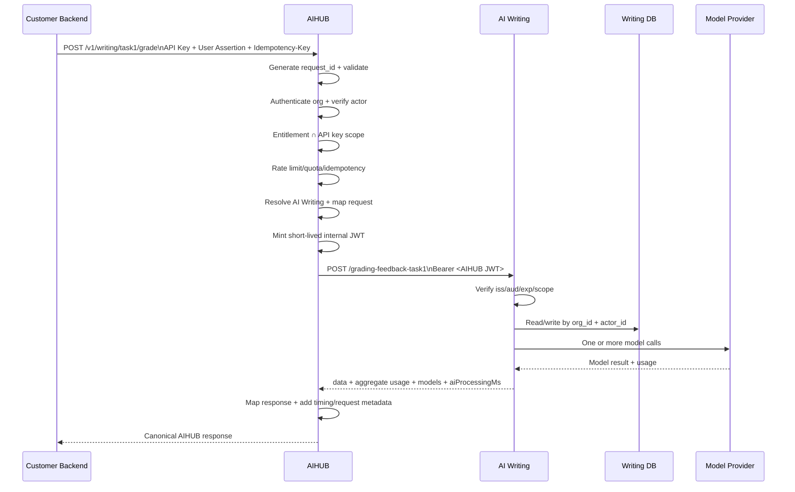

# AIHUB — Long-Term Architecture

> **Mục đích:** Mô tả kiến trúc đích dài hạn khi **AIHUB là public API gateway duy nhất**, còn các AI services phía sau chỉ expose **private API**.
>
> Tài liệu này là kiến trúc dài hạn. Các quyết định triển khai theo sprint/deliverable có thể đi theo từng phase.

---

# 1. Executive Summary

AIHUB được thiết kế như một **multi-tenant AI API Gateway + Identity Broker + Downstream Adapter Layer**.

```text
Customer Backend
       │
       │ AIHUB Public API
       │ Organization API Key
       │ Signed End-user Assertion (nếu operation cần user context)
       ▼
┌────────────────────────────────────┐
│               AIHUB                │
│                                    │
│ Public API Contract                │
│ Organization Authentication        │
│ End-user Identity Verification     │
│ Authorization                      │
│ Rate Limit / Quota                 │
│ Routing / Dispatching              │
│ Downstream Adapter                 │
│ Usage / Metering                   │
│ Unified Response / Error           │
│ Audit / Tracing                    │
└──────────────────┬─────────────────┘
                   │
                   │ Private network
                   │ Short-lived Internal JWT
                   │ (+ optional mTLS)
                   ▼
        ┌──────────┼───────────┐
        ▼          ▼           ▼
   AI Writing  AI Speaking  AI Reading
    PRIVATE      PRIVATE      PRIVATE
        │          │           │
        ▼          ▼           ▼
   Writing DB  Speaking DB Reading DB
        │          │           │
        └──── may call one or more ────┐
                                       ▼
                              Model Providers
                         OpenAI / Anthropic / ...
```

### End-state

- Client **không gọi trực tiếp** AI Writing / Speaking / Reading.
- AIHUB là public API boundary duy nhất.
- AI services chỉ reachable trong private network.
- Client chỉ phụ thuộc vào contract của AIHUB.
- AIHUB che giấu URL, contract và implementation details của downstream services.
- Business data vẫn do từng AI service/domain sở hữu.

---

# 2. Terminology — cần dùng thống nhất

Phần này rất quan trọng vì từ **Provider** dễ bị hiểu theo hai nghĩa khác nhau.

| Term | Ý nghĩa trong tài liệu |
|---|---|
| **Organization / Tenant** | Khách hàng/doanh nghiệp sử dụng AIHUB |
| **End User / Actor** | User/học viên cụ thể bên trong Organization |
| **AI Service** | Downstream service của hệ thống, ví dụ AI Writing, AI Speaking, AI Reading |
| **Model Provider** | Nền tảng/model bên dưới mà AI Service có thể gọi, ví dụ OpenAI, Anthropic, Google |
| **Downstream Adapter** | Lớp trong AIHUB map canonical contract sang contract của AI Service |
| **Canonical Contract** | Public request/response contract thống nhất của AIHUB |
| **Internal Contract** | Contract private giữa AIHUB và AI Service |
| **Organization Entitlement** | Những capability/service mà Organization được phép dùng theo plan/subscription |
| **API Key Scope** | Những capability cụ thể mà một API key được phép gọi |

> Nếu tài liệu/sprint vẫn dùng tên **Provider Mapper Rules**, nên hiểu chính xác là **AI Service / Downstream Adapter**, không phải mapper trực tiếp tới OpenAI/Anthropic.

---

# 3. Responsibility Boundary

## 3.1 AIHUB chịu trách nhiệm

- Public API contract.
- Organization authentication bằng API key.
- End-user identity verification khi operation cần user context.
- Authorization.
- Rate limiting / quota.
- Routing tới AI Service.
- Request/response transformation.
- Unified error mapping.
- Gateway-level timing.
- Usage aggregation/metering dựa trên metadata do AI Service trả về.
- Audit logging / tracing.
- Issuing short-lived internal JWT.

## 3.2 AI Service chịu trách nhiệm

- Domain/business logic.
- Domain database.
- Gọi model/RAG/tool/worker nội bộ.
- Trả usage/model/processing metadata mà chỉ service đó biết.
- Enforce downstream identity context (`org_id`, `actor_id`) khi truy cập user-scoped data.

## 3.3 Model Provider chịu trách nhiệm

- Inference/model execution.
- Model-specific token usage hoặc metering nếu API hỗ trợ.
- Model-specific errors/limits.

---

# 4. Public Boundary và Private AI Services

## 4.1 AIHUB là public boundary duy nhất

Public API — 4 operation của MVP, phần còn lại là phase sau:

```http
POST /v1/writing/task1/questions     # MVP
POST /v1/writing/task2/questions     # MVP
POST /v1/writing/task1/grade         # MVP
POST /v1/writing/task2/grade         # MVP

POST /v1/speaking/grade              # Phase 4, async
GET  /v1/jobs/{job_id}               # Phase 4
POST /v1/reading/analyze             # chưa có service
```

## 4.2 AI Services chỉ expose private API

Contract private của AI Writing **hiện tại** (đã khảo sát):

```http
POST /generate-question-task1
POST /question-generated-task2
POST /grading-feedback-task1
POST /grading-feedback-task2
```

Path phẳng, không version, đặt tên không nhất quán giữa hai task. **Đó chính là lý do lớp Downstream Adapter tồn tại** — public API vẫn đối xứng và có version, còn sự lộn xộn phía sau không rò ra ngoài. Đổi lại, AIHUB cũng không cần bắt AI Service đi sửa cho đẹp.

Endpoint chỉ được reachable từ private network / AIHUB.

> ⚠️ **Hiện đang vi phạm điều này.** `api-ielts-writing.aihubproduction.com` phân giải được từ Internet, và `/five-minute-grading` thậm chí không khai báo auth. Chừng nào còn như vậy thì khách hàng có thể đi vòng qua AIHUB, và **mọi rate limit / quota / metering đều vô nghĩa**. Việc đóng lại thuộc Phase 2 và là điều kiện để câu "AIHUB là public boundary duy nhất" thành sự thật thay vì mong muốn.

```text
Internet
   │
   X
   │
AI Writing

AIHUB
   │
   ✓
   ▼
AI Writing
```

Vì toàn bộ service đã private nên không bắt buộc phải có prefix `/internal`.

---

# 5. Multi-tenant Model

```text
AIHUB
└── Organization
    ├── API Keys
    ├── Entitlements
    ├── Plan / Subscription
    ├── Quota
    ├── Identity Configuration
    └── Usage
```

Không cần layer `Team` nếu requirement chỉ có một cấp Organization.

### Composite identity của end-user

AIHUB không nên giả định `external_user_id` unique toàn hệ thống.

Identity đúng là:

```text
(organization_id, external_user_id)
```

Ví dụ:

```text
Org A → user_123
Org B → user_123
```

Hai user trên là hai actor khác nhau.

---

# 6. Organization API Key

Customer Backend gửi:

```http
X-API-Key: aihub_sk_xxxxx
```

**Đã chốt `X-API-Key`** (§32.1). `Authorization` để dành riêng cho internal JWT ở boundary AIHUB → AI Service, tránh hai loại credential khác hẳn nhau dùng chung một header:

```text
Client  → AIHUB:   X-API-Key        = Organization credential
Client  → AIHUB:   X-User-Assertion = End-user identity
AIHUB   → AI Svc:  Authorization    = Bearer <internal JWT>
```

AIHUB dùng key để xác định:

```text
API Key
   ↓
Organization
   ↓
API Key Scopes
   ↓
Status / Expiry / Environment Binding
```

## 6.1 Không để frontend/mobile giữ Organization API Key

Nên:

```text
End User
   ↓
Web / Mobile
   ↓
Customer Backend
   │ AIHUB API Key
   ▼
AIHUB
```

Không nên:

```text
Browser / Mobile
   │ Org API Key
   ▼
AIHUB
```

## 6.2 API key storage

Không lưu raw key trong DB.

```text
api_keys
- id
- organization_id
- key_prefix              chỉ để hiển thị, KHÔNG dùng để lookup
- key_hash                sha256(raw), UNIQUE  ← đường lookup duy nhất
- name
- scopes
- status
- allowed_environments
- created_at
- expires_at
- last_used_at
- revoked_at
```

Raw key chỉ hiển thị một lần khi tạo.

**Hash bằng SHA-256, không phải bcrypt/argon2.** Raw key là 256 bit ngẫu nhiên từ CSPRNG nên không có từ điển nào để tấn công — slow hash không thêm chút an toàn nào, nhưng tốn ~100ms CPU *mỗi request*, tức là tự DoS chính mình. Stripe và GitHub đều dùng hash nhanh vì lý do này.

Hệ quả: `key_hash` UNIQUE nên lookup là **một index seek duy nhất**, không cần "tìm theo prefix rồi so hash từng cái", và cũng không cần so sánh constant-time vì ta lookup *bằng* hash chứ không so sánh nó.

Prefix cố định `aihub_sk_` còn giúp secret scanner của GitHub/GitLab bắt được khi khách lỡ commit key lên repo.

---

# 7. Environment — chọn một source of truth rõ ràng

Không nên để `environment` vừa derive từ API key vừa derive từ hostname mà không có precedence rule.

## Quyết định kiến trúc đề xuất

**Deployment hostname là source of truth cho environment.**

```text
api.aihub.example.com          → production
staging-api.aihub.example.com  → staging
dev-api.aihub.example.com      → development
```

API key có thể được **bind vào allowed environments**, nhưng không tự quyết định environment của request.

Ví dụ:

```text
Request tới staging-api.aihub...
        ↓
environment = staging
        ↓
API Key có allowed_environments chứa staging?
        ↓
Yes → tiếp tục
No  → 403
```

Như vậy không có xung đột kiểu:

```text
hostname = production
API key says = test
```

> Nếu sau này team dùng khái niệm `live/test` như business mode thay vì deployment environment, nên đặt tên riêng (`mode`) để tránh lẫn với `dev/staging/prod`.

---

# 8. Làm sao AIHUB biết chính xác ai trong Organization gửi request?

Organization API key chỉ trả lời:

> Request thuộc Organization nào?

Nó **không đủ** để xác định user/học viên cụ thể.

## 8.1 Trust model đề xuất: Signed End-user Assertion

Flow:

```text
End User
   ↓ login/auth với hệ thống của Customer
Customer Backend
   │
   │ tạo Signed User Assertion
   ▼
AIHUB
   │ verify signature + claims
   ▼
Trusted Actor Context
```

Customer Backend gửi:

```http
X-API-Key: aihub_sk_xxx
X-User-Assertion: <SIGNED_JWT>
```

Ví dụ payload:

```json
{
  "iss": "org_123",
  "sub": "student_456",
  "aud": "aihub",
  "iat": 1788350000,
  "exp": 1788350300,
  "jti": "ua_01JXYZ"
}
```

Trong đó:

- `iss` → identity issuer đã đăng ký cho Organization.
- `sub` → `external_user_id` của actor bên hệ thống khách hàng.
- `aud` → phải là `aihub`.
- `exp` → assertion sống ngắn.
- `jti` → optional, phục vụ audit/replay detection nếu cần.

## 8.2 Ai ký assertion?

**Customer Backend ký**, không phải browser/mobile.

Khuyến nghị asymmetric signing:

```text
Customer Backend
  └── Private Key → sign assertion

AIHUB
  └── Public Key / JWKS của Organization → verify
```

AIHUB lưu identity config:

```text
organization_identity_configs
- organization_id
- issuer                      UNIQUE toàn hệ thống  ← chặn cross-tenant
- jwks_url                    đường chính
- public_keys_jwks            fallback cho org chưa host được JWKS
- allowed_algorithms          mặc định {RS256, ES256}
- max_assertion_ttl_seconds   mặc định 300
- status
```

Ràng buộc: phải có ít nhất một trong `jwks_url` hoặc `public_keys_jwks`.

**`jwks_url` là một lỗ SSRF nếu không kiểm soát** — đó là URL do khách hàng cung cấp mà AIHUB sẽ tự đi gọi. Bắt buộc: chỉ `https`, resolve DNS trước rồi chặn private/loopback/link-local (đặc biệt `169.254.169.254`), **chặn redirect** (`maxRedirections: 0` — kiểm IP xong mà cho redirect thì việc kiểm vô nghĩa), timeout 3s, giới hạn 64KB, không gửi kèm credential nào.

Fetch hỏng nhưng còn cache cũ → **dùng cache cũ tới 24h**; public key không tự nhiên thành độc hại, và điều này giữ AIHUB sống khi JWKS của khách sập. Không có cache nào → `503 IDENTITY_PROVIDER_UNAVAILABLE`.

## 8.3 AIHUB verify gì?

Theo đúng thứ tự này — rẻ trước, crypto sau cùng:

```text
1. alg ∈ allowed_algorithms của org      # CHẶN 'none', chặn HS* khi key là RSA/EC
2. aud == "aihub"
3. iss == issuer đã đăng ký cho org lấy từ API key
4. exp > now - 60s  ∧  iat < now + 60s   # clock skew ±60s
5. (exp - iat) <= max_assertion_ttl_seconds
6. jti có mặt
7. signature hợp lệ theo JWKS của org
```

Ba ràng buộc dễ bị bỏ sót, mỗi cái chặn một lớp tấn công riêng:

**Bước 1 — alg confusion.** Token khai `alg: HS256`, thư viện lấy public key RSA làm HMAC secret; public key thì ai cũng có → giả token thoải mái. Allowlist `alg` phải theo từng org, và loại khoá phải khớp thuật toán.

**Bước 3 + `UNIQUE(issuer)`.** Kiểm `iss` khớp org là chưa đủ nếu bảng identity config cho phép hai org đăng ký trùng `issuer`. Cột `issuer` phải unique toàn hệ thống, nếu không Org B đăng ký trùng `iss` của Org A rồi tự ký assertion mạo danh học viên của A.

**Bước 5 — trần TTL.** Không giới hạn thì khách ký được assertion `exp` sau 5 năm rồi nhúng vào app mobile; assertion biến thành một API key vĩnh viễn bị rò. Xem `max_assertion_ttl_seconds` ở §8.2.

Nếu API key thuộc Org A nhưng assertion do Org B phát:

```text
API Key → Org A
Assertion issuer → Org B
        ↓
403 Forbidden
```

## 8.4 AIHUB có cần quản lý toàn bộ user của customer không?

**Không bắt buộc.**

Trong mô hình B2B API này, AIHUB có thể trust Organization xác nhận actor thông qua signed assertion.

AIHUB chỉ cần trusted context:

```text
organization_id = org_123
actor_id        = student_456
```

## 8.5 Operation nào cần User Assertion?

Nên phân loại operation:

```text
Organization-scoped operation
→ không bắt buộc end-user assertion

User-scoped operation
→ bắt buộc end-user assertion
```

Ví dụ:

| Operation | User Assertion |
|---|---|
| `GET /v1/account/usage` | Không nhất thiết |
| `POST /v1/writing/task1/questions` | Không — sinh đề không gắn học viên |
| `POST /v1/writing/task2/questions` | Không |
| `POST /v1/writing/task1/grade` | **Có** — kết quả thuộc một học viên |
| `POST /v1/writing/task2/grade` | **Có** |

---

# 9. Request Identity Context trong AIHUB

Sau khi authenticate/verify, AIHUB normalize thành context nội bộ:

```ts
interface RequestIdentity {
  organizationId: string;
  apiKeyId: string;
  actorId?: string;
  effectiveScopes: string[];
}
```

Không để controller/business logic đọc raw headers để tự suy identity.

---

# 10. Authorization — Entitlement và API Key Scope là hai lớp khác nhau

Organization có thể mua:

```text
writing
speaking
```

Nhưng một key cụ thể chỉ được cấp:

```text
writing.grade
writing.history.read
```

Effective permission:

```text
Organization Entitlement
          ∩
     API Key Scope
          ↓
    Effective Scope
```

Ví dụ endpoint cần:

```text
writing.grade
```

AIHUB chỉ cho qua nếu scope này nằm trong **effective scopes**.

Internal JWT chỉ nên chứa scope tối thiểu cần cho downstream request.

---

# 11. AIHUB → AI Service: Short-lived Internal JWT

AIHUB không forward nguyên customer credential xuống AI Service.

Sau khi authenticate + authorize, AIHUB mint JWT nội bộ:

```json
{
  "iss": "aihub",
  "aud": "ai-writing",
  "org_id": "org_123",
  "sub": "student_456",
  "scope": ["writing.grade"],
  "iat": 1788350000,
  "exp": 1788350060,
  "jti": "req_01JXYZ"
}
```

AIHUB gọi:

```http
POST http://ai-writing/v1/grade
Authorization: Bearer <AIHUB_INTERNAL_JWT>
```

AI Writing verify:

```text
signature valid
iss == aihub
aud == ai-writing
exp valid
scope contains writing.grade
```

## 11.1 Ai ký?

**AIHUB là issuer nên AIHUB ký token.**

Khuyến nghị:

```text
AIHUB Private Key → sign
AI Services       → verify bằng AIHUB Public Key/JWKS
```

## 11.2 Khi nào mint?

Mint **just-in-time cho từng downstream request**.

```text
Incoming request
      ↓
Authenticate
      ↓
Authorize
      ↓
Resolve AI Service
      ↓
Mint short-lived JWT
      ↓
Call downstream immediately
```

TTL gợi ý: khoảng 30 giây – 2 phút tùy network/operation.

Không cần refresh token và không lưu JWT vào DB.

---

# 12. Service-to-service Security

```text
Private network / firewall / NetworkPolicy
                +
          Internal JWT
                +
          Optional mTLS
```

Ý nghĩa:

```text
Network policy / mTLS
→ service/workload nào đang kết nối?

Internal JWT
→ request đang đại diện cho org/actor/scope nào?
```

---

# 13. Canonical Public API Contract

Client chỉ phụ thuộc contract của AIHUB.

Ví dụ chấm bài Task 1 — `POST /v1/writing/task1/grade`:

```json
{
  "question": "The chart below shows the number of visitors to three museums...",
  "topic": "museum visitors",
  "essay": "The bar chart illustrates...",
  "image_url": "https://cdn.customer.example.com/charts/abc.png"
}
```

Adapter đổi tên `image_url` → `url` trước khi gọi downstream. Client không cần biết AI Writing đặt tên field là gì, cũng không cần biết endpoint thật tên `/grading-feedback-task1`.

Task 2 dùng đúng schema đó **trừ `image_url`** — gửi kèm sẽ bị `400`.

Schema đầy đủ và Data Dictionary: `AIHUB_Deliverable_1_API_Contract_Schema.md` §10 và §20.

---

# 14. Downstream Adapter Layer

> Đây là khái niệm mà Deliverable 1 có thể đang gọi là **Provider Mapper Rules**.

Flow:

```text
Canonical AIHUB Request
         ↓
Downstream Resolver
         ↓
AI Service Adapter
         ↓
AI Service Private API
         ↓
AI Service Response
         ↓
Response Adapter
         ↓
Canonical AIHUB Response
```

Interface gợi ý:

```ts
interface DownstreamAdapter<TCanonicalReq, TCanonicalRes> {
  mapRequest(
    input: TCanonicalReq,
    context: RequestContext,
  ): unknown;

  mapResponse(
    response: InternalAIServiceResponse<unknown>,
  ): TCanonicalRes;

  mapError(error: unknown): InternalDownstreamError;
}
```

Adapter có thể xử lý:

- field rename;
- enum/value conversion;
- default values;
- nested object transformation;
- unsupported options;
- file/media transformation;
- service-specific response normalization;
- service-specific error mapping.

MVP nên adapter bằng code thay vì xây dynamic rule engine quá sớm.

---

# 15. Internal AI Service Response Contract

Cần phân biệt rõ:

```text
Domain data
→ có thể khác nhau giữa Writing / Speaking / Reading

Operational metadata
→ nên chuẩn hóa giữa mọi AI Service
```

## 15.1 Contract đề xuất

```ts
interface InternalAIServiceResponse<TData> {
  data: TData;

  usage?: {
    inputTokens: number;
    outputTokens: number;
    totalTokens: number;

    // Optional: chi tiết khi operation gọi nhiều model lần.
    calls?: Array<{
      modelProvider?: string;
      model?: string;
      inputTokens: number;
      outputTokens: number;
      totalTokens: number;
    }>;
  };

  models?: Array<{
    provider?: string;
    name?: string;
  }>;

  metrics?: {
    aiProcessingMs?: number;
  };
}
```

### Quy tắc

- `data` là **service-specific domain payload**.
- `usage`, `models`, `metrics` là **common internal metadata**.
- Response Adapter chịu trách nhiệm map `data` thành canonical public data.
- AIHUB không tự đoán token usage.

---

# 16. Token Usage khi một request gọi model nhiều lần

Một operation có thể:

```text
LLM call #1
+ RAG
+ LLM call #2
+ evaluator model
```

Nếu chỉ trả usage của một call thì billing/metering sẽ sai.

## Quyết định đề xuất

`usage.inputTokens`, `outputTokens`, `totalTokens` là **aggregate của toàn operation**.

Ví dụ:

```json
{
  "usage": {
    "inputTokens": 2100,
    "outputTokens": 700,
    "totalTokens": 2800,
    "calls": [
      {
        "modelProvider": "provider-a",
        "model": "model-x",
        "inputTokens": 1300,
        "outputTokens": 450,
        "totalTokens": 1750
      },
      {
        "modelProvider": "provider-b",
        "model": "model-y",
        "inputTokens": 800,
        "outputTokens": 250,
        "totalTokens": 1050
      }
    ]
  }
}
```

Public API có thể chỉ expose aggregate; breakdown có thể optional hoặc chỉ dùng cho internal metering.

---

# 17. Unified Response — Timing và Source of Truth

## 17.1 Timing definitions

Không dùng `provider_ms` nếu từ này có thể lẫn giữa AI Service và Model Provider.

Khuyến nghị:

```text
total_ms
= AIHUB ingress → AIHUB egress

downstream_ms
= từ lúc AIHUB bắt đầu HTTP call tới AI Service
  cho tới khi AIHUB nhận xong response
  (bao gồm network + AI Service execution)

ai_processing_ms
= thời gian AI Service tự đo phần xử lý AI nội bộ
  (optional, không bao gồm network AIHUB ↔ AI Service)

gateway_overhead_ms
≈ total_ms - downstream_ms
```

Không giả định:

```text
total_ms = gateway_ms + ai_processing_ms
```

vì còn network/downstream overhead.

## 17.2 Unified public response

```json
{
  "data": {
    "overall_band": 6.5,
    "criteria": [
      { "id": "task_achievement",           "name": "Task Achievement",
        "band": 6.0, "feedback": "..." },
      { "id": "coherence_cohesion",         "name": "Coherence and Cohesion",
        "band": 7.0, "feedback": "..." },
      { "id": "lexical_resource",           "name": "Lexical Resource",
        "band": 6.5, "feedback": "..." },
      { "id": "grammatical_range_accuracy", "name": "Grammatical Range and Accuracy",
        "band": 6.0, "feedback": "..." }
    ],
    "summary": "A solid response that reports the main features accurately.",
    "word_count": 178
  },
  "meta": {
    "request_id": "req_01JXYZ",
    "service": "writing",
    "operation": "writing.task1.grade",
    "usage": {
      "input_tokens": 820,
      "output_tokens": 310,
      "total_tokens": 1130
    },
    "timing": {
      "downstream_ms": 810,
      "ai_processing_ms": 790,
      "gateway_overhead_ms": 30,
      "total_ms": 840
    }
  }
}
```

**`meta.models[]` đã bị bỏ khỏi public response.** Bản trước có trường này, nhưng nó mâu thuẫn với chính §32.7 của tài liệu này — vốn chốt rằng public API chỉ expose aggregate usage, còn chi tiết model giữ cho internal. Cho khách thấy tên model cụ thể sẽ khiến public contract phụ thuộc implementation phía sau: đổi model hay đổi provider trở thành breaking change, hoặc tệ hơn là khách bắt đầu viết logic dựa trên tên model.

`models[]` vẫn có ở internal contract và vẫn được ghi vào `usage_records` cho metering/debug/tính giá theo model.

`criteria` là **mảng chứ không phải 4 field cố định**, vì Task 1 gọi tiêu chí đầu là *Task Achievement* còn Task 2 gọi là *Task Response*. Mảng có `id` ổn định cho phép client dùng chung một component render cho cả hai task.

## 17.3 Source-of-truth matrix

| Field | Source of truth |
|---|---|
| `request_id` | AIHUB |
| `service` / `operation` | AIHUB routing metadata |
| `total_ms` | AIHUB |
| `downstream_ms` | AIHUB |
| `gateway_overhead_ms` | AIHUB derived metric |
| `ai_processing_ms` | AI Service |
| `input_tokens` | AI Service / underlying Model Provider |
| `output_tokens` | AI Service / underlying Model Provider |
| `total_tokens` | AI Service aggregate |
| model(s) thực tế | AI Service — **internal only**, không có trong public response |
| `metering_status` | AIHUB — internal only. `complete` / `missing_usage` / `not_applicable` / `quota_unverified` |
| public cost | AIHUB từ normalized usage + pricing config, hoặc business rule riêng |

> Endpoint không gọi model nên **omit `usage`** hoặc trả `null`; không nên giả token bằng `0`.

---

# 18. Request ID và Correlation ID

Canonical `request_id` phải do **AIHUB generate**.

Không nên tin request ID từ client làm primary tracing ID.

Client có thể gửi optional:

```http
X-Correlation-Id: customer-request-123
```

AIHUB log:

```text
request_id      = req_01JXYZ      // AIHUB generated
correlation_id  = customer-request-123  // client supplied
```

AIHUB có thể echo `correlation_id` trong metadata nếu contract cần.

---

# 19. Retry và Idempotency

AI operation có thể tốn tiền/token và tạo side effect.

Ví dụ:

```text
AI Service chạy model xong
        ↓
response bị timeout trên network
        ↓
AIHUB retry mù
        ↓
model chạy lần 2 + tạo record lần 2
```

## 19.1 Idempotency-Key

Với POST có side effect hoặc cost cao, nên support:

```http
Idempotency-Key: 8b8e1f9e-...
```

Scope gợi ý:

```text
(organization_id, operation, idempotency_key)
```

Behavior:

- Cùng key + cùng canonical request → trả lại kết quả cũ hoặc trạng thái đang xử lý.
- Cùng key + request khác → `409 IDEMPOTENCY_CONFLICT`.
- Có TTL rõ ràng cho idempotency record.

## 19.2 Retry policy

Không retry mọi lỗi.

```text
400/401/403 → không retry
429 từ AIHUB → client backoff theo Retry-After
503 downstream throttled/unavailable → retry có backoff nếu operation idempotent
504 timeout → chỉ retry khi operation idempotent hoặc có Idempotency-Key
```

---

# 20. Unified Error Model

Public error:

```json
{
  "error": {
    "code": "AI_SERVICE_TIMEOUT",
    "message": "AI service did not respond in time",
    "request_id": "req_01JXYZ",
    "retryable": true,
    "retry_after_ms": 2000
  }
}
```

## 20.1 Phân biệt rate limit của AIHUB và downstream

Không nên dùng cùng `429 RATE_LIMITED` cho hai tình huống khác nhau.

| Tình huống | HTTP | Public code |
|---|---:|---|
| Client vượt AIHUB rate limit | 429 | `RATE_LIMITED` |
| Client chạy quá nhiều request đồng thời | 429 | `CONCURRENCY_LIMIT` |
| Organization hết quota | 429 | `QUOTA_EXCEEDED` |
| AI Service / Model Provider bị throttled | 503 | `AI_SERVICE_THROTTLED` |
| AI Service timeout | 504 | `AI_SERVICE_TIMEOUT` |
| AI Service 5xx | 502/503 | `AI_SERVICE_ERROR` / `AI_SERVICE_UNAVAILABLE` |
| AI Service trả shape không parse được | 502 | `AI_SERVICE_CONTRACT_VIOLATION` |
| JWKS của Organization không lấy được | 503 | `IDENTITY_PROVIDER_UNAVAILABLE` |

Danh sách đầy đủ **18 mã cho v1**: `AIHUB_Deliverable_1_API_Contract_Schema.md` §25.

Hai mã cuối bảng đáng được tách riêng vì chúng dẫn tới hành động khác hẳn: `AI_SERVICE_CONTRACT_VIOLATION` nghĩa là **ai đó vừa deploy AI Service**, không phải sự cố hạ tầng — gộp vào `AI_SERVICE_ERROR` sẽ khiến đội trực đi tìm sai chỗ. `IDENTITY_PROVIDER_UNAVAILABLE` nghĩa là JWKS endpoint **của chính khách hàng** đang hỏng — trả `401` sẽ khiến họ đi tạo lại API key một cách vô ích.

Tương tự, `CONCURRENCY_LIMIT` tách khỏi `RATE_LIMITED` vì cách khắc phục khác nhau: một bên phải giảm **tần suất**, bên kia phải giảm **số request chạy song song** — có thể vẫn giữ nguyên tổng mỗi phút.

Khi có thể, trả `Retry-After` hoặc `retry_after_ms`.

Raw downstream error chỉ log nội bộ, không leak:

- stack trace;
- private URL;
- DB error;
- provider/model secrets;
- raw model/provider exception không cần thiết.

---

# 21. Sync vs Async Operations

Không nên để tất cả endpoint mặc định sync nếu operation có thể chạy lâu.

## 21.1 Sync pattern

Phù hợp với operation ngắn:

```http
POST /v1/writing/task1/grade
→ 200 OK
```

## 21.2 Async pattern

Phù hợp với audio/video/pipeline dài:

```http
POST /v1/speaking/grade
→ 202 Accepted
```

```json
{
  "data": {
    "job_id": "job_01JXYZ",
    "status": "queued"
  }
}
```

Sau đó:

```http
GET /v1/jobs/{job_id}
```

hoặc webhook/callback nếu platform hỗ trợ.

> Contract catalog phải ghi rõ **mỗi operation là sync hay async**; không để implementation tự quyết định sau khi client đã tích hợp.

---

# 22. File / Audio / Media Input Policy

Không nên để mỗi capability tự chọn base64/multipart/url tùy ý.

## Quy tắc đề xuất

### Text / small JSON

```http
Content-Type: application/json
```

### Small/medium media upload

Có thể hỗ trợ:

```http
Content-Type: multipart/form-data
```

với size limit rõ ràng.

### Large media

Ưu tiên:

```text
Client upload tới object storage bằng presigned URL
        ↓
nhận asset_id
        ↓
gọi AIHUB bằng asset_id
```

Ví dụ:

```json
{
  "audio": {
    "asset_id": "asset_01JXYZ"
  }
}
```

Không khuyến nghị base64 cho file lớn vì tăng payload/memory/bandwidth.

> D1/API contract phải chốt input mode cho từng operation, đặc biệt Speaking.

---

# 23. Routing Catalog

| Public Endpoint | Operation | Required Scope | Identity | AI Service |
|---|---|---|---|---|
| `POST /v1/writing/task1/questions` | `writing.task1.question.generate` | `writing.question.generate` | org | AI Writing |
| `POST /v1/writing/task2/questions` | `writing.task2.question.generate` | `writing.question.generate` | org | AI Writing |
| `POST /v1/writing/task1/grade` | `writing.task1.grade` | `writing.grade` | **user** | AI Writing |
| `POST /v1/writing/task2/grade` | `writing.task2.grade` | `writing.grade` | **user** | AI Writing |
| `POST /v1/speaking/grade` | `speaking.grade` | `speaking.grade` | **user** | AI Speaking *(Phase 4)* |
| `POST /v1/reading/analyze` | `reading.analyze` | `reading.analyze` | **user** | AI Reading *(chưa có)* |

Sinh đề là `organization`-scoped vì kết quả không thuộc về học viên nào; chấm bài là `user`-scoped vì kết quả gắn với một học viên cụ thể. Đúng theo nguyên tắc fail-closed ở §32.4.

**Routing catalog nằm ở code, không ở database.** Adapter vốn đã là code nên thêm AI Service mới vẫn phải deploy — config trong DB không giúp tránh deploy, chỉ tách sự thật ra làm hai chỗ. Quan trọng hơn: **URL downstream nằm trong DB là một lỗ SSRF** — ai ghi được vào bảng đó thì trỏ được AIHUB vào `169.254.169.254`, trong khi AIHUB đang cầm internal JWT. Downstream URL để ở biến môi trường thì không có bề mặt tấn công đó.

Flow:

```text
Endpoint
   ↓
Operation
   ↓
Required Scope
   ↓
Organization Entitlement ∩ API Key Scope
   ↓
Downstream Resolver
   ↓
AI Service Adapter
```

---

# 24. Rate Limit, Quota và Billing

Có thể rate-limit theo:

```text
organization_id
api_key_id
service / operation
```

Usage/billing phải dựa trên normalized usage do AI Service trả về, không dựa trên token estimate tại gateway.

Nếu usage thiếu:

- không tự bịa số;
- đánh dấu metering incomplete;
- log/metric để phát hiện contract violation;
- business rule quyết định fail request hay cho qua tùy operation/plan.

---

# 25. Observability

Mỗi request có AIHUB-generated `request_id`.

```text
Customer Backend
      │ correlation-id optional
      ▼
    AIHUB
      │ request_id = req-123
      ▼
 AI Writing
      │ req-123
      ▼
 Worker / DB / Model Provider
```

Nên đo:

- request count;
- latency p50/p95/p99;
- `downstream_ms`;
- `ai_processing_ms` nếu downstream cung cấp;
- error rate theo AI Service;
- Model Provider error/throttle rate nếu AI Service expose internal metric;
- rate-limit/quota rejects;
- token usage từ downstream;
- circuit breaker state.

`request_id` là tracing metadata, **không phải identity**.

---

# 26. Data Ownership

AIHUB giữ control-plane data:

```text
organizations
api_keys
plans
subscriptions
organization_entitlements
api_key_scopes
routing_rules
downstream_configs
quota_configs
usage_records
identity_configs
idempotency_records
```

Business data:

```text
Writing attempts/results → Writing DB
Speaking results/audio   → Speaking DB / Object Storage
Reading results          → Reading DB
```

---

# 27. Module Design gợi ý

```text
src/
├── gateway/
│   ├── controllers/
│   ├── dto/
│   ├── validation/
│   └── request-context/
│
├── auth/
│   ├── api-key/
│   ├── user-assertion/
│   └── authorization/
│
├── downstream/
│   ├── resolver/
│   ├── writing/
│   ├── speaking/
│   └── reading/
│
├── routing/
│   ├── routing.service.ts
│   └── dispatcher.service.ts
│
├── internal-token/
│   └── token-issuer.service.ts
│
├── errors/
│   ├── error-codes.ts
│   ├── error-mapper.ts
│   └── exception-filter.ts
│
├── idempotency/
├── metering/
├── rate-limit/
└── observability/
```

---

# 28. Full Request Flow

Ví dụ `POST /v1/writing/task1/grade`:

```text
1. Customer Backend
       │
       │ Organization API Key
       │ Signed End-user Assertion
       │ Idempotency-Key (nếu operation yêu cầu)
       ▼
2. AIHUB Public API
       │
       ├─ Generate request_id
       ├─ Validate canonical request
       ├─ Authenticate API key
       ├─ Resolve organization
       ├─ Resolve environment từ deployment host
       ├─ Verify key được phép dùng trong environment
       ├─ Verify end-user assertion
       ├─ Compute effective scope
       ├─ Authorize writing.grade
       ├─ Check rate limit/quota
       ├─ Check idempotency
       │
       ▼
3. Downstream Resolver
       │ writing.grade → AI Writing
       ▼
4. Downstream Adapter
       │ canonical request → AI Writing payload
       ▼
5. Internal Token Issuer
       │ short-lived JWT: org + actor + scope
       ▼
6. AI Writing Private API
       │ verify AIHUB JWT
       │ execute domain logic
       │ access data scoped by (org_id, actor_id)
       │ may call one/many models
       ▼
7. AI Writing Internal Response
       │ service-specific data
       │ + standardized usage/models/metrics
       ▼
8. AIHUB Response Adapter
       │ map service-specific data → canonical public data
       │ aggregate/normalize metadata
       ▼
9. AIHUB add gateway metadata
       │ request_id
       │ total_ms/downstream_ms/gateway_overhead_ms
       │ metering/audit/tracing
       ▼
10. Customer Backend
```

---

# 29. Sequence Diagram



---

# 30. Kiến trúc chốt

> **AIHUB is a multi-tenant AI API Gateway that authenticates organizations using API keys, verifies end-user assertions for user-scoped operations, computes effective authorization from organization entitlements and API-key scopes, normalizes public API contracts, maps requests to private AI services, and propagates trusted identity downstream using short-lived internal JWTs.**

Tóm tắt identity chain:

```text
Organization API Key
        ↓
Organization Identity

Signed End-user Assertion
        ↓
Actor Identity

AIHUB Internal JWT
        ↓
Trusted Downstream Identity
(org_id + actor_id + scope)
```

---

# 31. Roadmap gợi ý

## Phase 1 — Contract Foundation

- Canonical endpoint/request/response.
- Organization API Key contract.
- End-user identity contract cho user-scoped operation.
- Downstream adapter contract.
- Unified error codes.
- Internal usage/timing metadata contract.
- Operation catalog: sync/async, content type, scope, identity requirement.

## Phase 2 — Core Gateway + Secure Private AI Services

- API key middleware/storage.
- Routing/dispatcher.
- AI services private-only.
- AIHUB internal JWT.
- Network policies/firewall.
- User assertion verification.
- Request/response adapters.

## Phase 3 — Platform Capabilities

- Rate limiting.
- Quota.
- Subscription/plan.
- Usage metering.
- Billing.
- Audit logs.
- Idempotency.

## Phase 4 — Reliability & Scale

- Circuit breaker.
- Retry policy + backoff/jitter.
- Load shedding/backpressure.
- Downstream failover/routing policy.
- Distributed tracing.
- SLO/SLI dashboards.

---

# 32. Open Decisions — đã chốt

> **Trạng thái 2026-09-07: cả 10 quyết định đã chốt theo Recommended default.**
> Toàn bộ đã được phản ánh vào `AIHUB_Deliverable_1_API_Contract_Schema.md` và vào architecture design ở
> [`docs/superpowers/specs/2026-09-07-aihub/`](docs/superpowers/specs/2026-09-07-aihub/README.md).
> Giữ nguyên phần options bên dưới làm hồ sơ lý do — sau này muốn đổi thì đọc lại trade-off đã cân nhắc.

Phần này liệt kê các quyết định kiến trúc cần team xác nhận trước khi coi contract/architecture là ổn định.
Mỗi decision có **option gợi ý mặc định**; nếu team không có yêu cầu đặc biệt thì dùng luôn option được đánh dấu **Recommended default** để tránh block implementation.

> Nguyên tắc: các default dưới đây ưu tiên **contract rõ ràng, security đủ tốt, dễ triển khai ở phase đầu và vẫn có đường nâng cấp về sau**.

---

## 32.1 API key dùng `X-API-Key` hay `Authorization`?

### Options

**Option A — `X-API-Key`**

```http
X-API-Key: aihub_sk_live_xxx
```

**Option B — `Authorization: Bearer`**

```http
Authorization: Bearer aihub_sk_live_xxx
```

### Recommended default

**Chọn `X-API-Key`.**

### Lý do

AIHUB đang có nhiều loại credential/context khác nhau như Organization API Key, User Assertion và internal JWT. Dùng `X-API-Key` giúp vai trò của Organization API Key rõ ràng hơn và tránh nhầm với bearer JWT ở các boundary khác.

Quy ước đề xuất:

```text
Client → AIHUB:
X-API-Key          = Organization credential
X-User-Assertion   = End-user identity assertion (khi operation user-scoped)

AIHUB → AI Service:
Authorization      = Bearer <AIHUB_INTERNAL_JWT>
```

---

## 32.2 User Assertion dùng JWKS URL hay upload public key?

### Options

**Option A — JWKS URL**

Organization đăng ký một URL như:

```text
https://customer.example.com/.well-known/jwks.json
```

AIHUB fetch/cached public keys theo `kid` để verify assertion.

**Option B — Upload/Register public key trực tiếp trên AIHUB**

Organization upload PEM/public key trong portal hoặc qua admin API.

### Recommended default

**Ưu tiên JWKS URL.**  
**Public-key upload có thể giữ làm fallback cho Organization chưa có JWKS.**

### Lý do

JWKS hỗ trợ key rotation tốt hơn, không cần cập nhật thủ công public key ở AIHUB mỗi lần rotate và phù hợp với B2B federation lâu dài. Upload public key dễ làm hơn cho MVP nhưng operational burden cao hơn khi số Organization tăng.

---

## 32.3 TTL tối đa của User Assertion?

### Options

- 1–2 phút: security chặt nhưng dễ gặp clock skew/network delay.
- 5 phút: cân bằng security và khả năng vận hành.
- 15 phút trở lên: dễ sử dụng hơn nhưng replay window lớn hơn.

### Recommended default

**TTL tối đa: 5 phút.**

Ngoài ra nên yêu cầu:

```text
exp - iat <= 5 phút
clock skew cho phép khoảng ±60 giây
jti nên có nếu cần chống replay ở operation nhạy cảm
```

### Lý do

User Assertion nên là credential ngắn hạn, được Customer Backend tạo gần thời điểm gọi AIHUB. 5 phút đủ chịu network delay/clock skew nhưng vẫn giới hạn replay window.

---

## 32.4 Operation nào organization-scoped, operation nào user-scoped?

### Options

**Organization-scoped**: chỉ cần xác định Organization.

Ví dụ:

```text
- service/catalog metadata
- organization usage summary
- organization configuration
- health/capability discovery
```

**User-scoped**: operation đọc, tạo hoặc thay đổi dữ liệu gắn với một end user cụ thể.

Ví dụ:

```text
- writing.grade
- writing.history
- speaking.grade
- speaking.history
- user-specific feedback/result
```

### Recommended default

**Mặc định mọi operation có đọc/ghi dữ liệu cá nhân hoặc kết quả AI của một end user là `user-scoped`.**  
Chỉ các operation thực sự ở cấp Organization mới là `organization-scoped`.

Operation Catalog phải khai báo explicit:

```yaml
identity_scope: user
```

hoặc:

```yaml
identity_scope: organization
```

### Lý do

Fail-closed an toàn hơn fail-open. Nếu chưa chắc một operation có cần user identity hay không thì coi là user-scoped trước, sau đó relax khi requirement rõ ràng.

---

## 32.5 Operation nào sync, operation nào async?

### Options

**Sync**

```text
Request → AIHUB → AI Service → Response ngay
```

Phù hợp operation ngắn và predictable.

**Async**

```text
POST request
→ 202 Accepted + job_id
→ xử lý background
→ client GET /jobs/{job_id} hoặc webhook
```

Phù hợp operation lâu, xử lý file/audio lớn hoặc pipeline nhiều bước.

### Recommended default

- **Sync** nếu expected processing time thường **≤ 30 giây**.
- **Async** nếu có khả năng thường xuyên **> 30 giây**, xử lý media lớn, hoặc pipeline nhiều bước.

Ví dụ mặc định ban đầu:

```text
Writing grade ngắn          → sync
Simple text generation      → sync
Speaking/audio dài          → async
Long-running analysis       → async
Batch processing            → async
```

### Lý do

Giữ API đơn giản cho request nhanh nhưng tránh giữ HTTP connection lâu và timeout/retry khó kiểm soát cho workload nặng.

---

## 32.6 File/audio dùng multipart hay `asset_id` + presigned upload?

### Options

**Option A — `multipart/form-data`**

Client upload trực tiếp file qua request API.

**Option B — Presigned upload + `asset_id`**

```text
1. Client xin upload URL
2. Upload trực tiếp object storage
3. Nhận/giữ asset_id
4. Gọi AI operation bằng asset_id
```

### Recommended default

**Long-term: ưu tiên presigned upload + `asset_id` cho audio/file.**  
Cho phép `multipart/form-data` với file nhỏ, đơn giản (gợi ý ≤ 10 MB) hoặc cho MVP.

### Lý do

Không đẩy file lớn xuyên qua toàn bộ API Gateway giúp giảm memory/bandwidth pressure lên AIHUB, dễ retry upload và scale tốt hơn. Multipart vẫn tiện cho integration nhỏ nên không cần cấm hoàn toàn.

---

## 32.7 Public response expose model breakdown hay chỉ aggregate usage?

### Options

**Option A — Aggregate usage only**

```json
{
  "usage": {
    "input_tokens": 1200,
    "output_tokens": 300,
    "total_tokens": 1500
  }
}
```

**Option B — Expose breakdown từng model call**

```json
{
  "usage": {
    "total_tokens": 1500,
    "calls": [
      { "model": "...", "input_tokens": 800, "output_tokens": 200 },
      { "model": "...", "input_tokens": 400, "output_tokens": 100 }
    ]
  }
}
```

### Recommended default

**Public API chỉ expose aggregate usage.**  
Model/call breakdown giữ cho internal metering, observability hoặc admin/debug API nếu sau này cần.

### Lý do

AIHUB có mục tiêu abstraction các AI Service/Model Provider. Expose chi tiết model quá sớm sẽ làm public contract phụ thuộc implementation phía sau và khó đổi provider/model về sau.

---

## 32.8 Nếu AI Service không trả usage metadata thì xử lý thế nào?

### Options

**Option A — Fail request ngay**

AIHUB coi missing usage là protocol violation và trả lỗi cho client.

**Option B — Trả business response nhưng đánh dấu metering incomplete**

```text
- trả kết quả thành công cho client
- log/metric metering_status = INCOMPLETE
- alert nội bộ
- enqueue reconciliation nếu có thể
- provider/service vi phạm lặp lại có thể bị disable/circuit-break
```

### Recommended default

**Chọn Option B ở runtime. Không làm fail một business response đã xử lý thành công chỉ vì thiếu usage metadata.**

Tuy nhiên đối với operation `metering-critical`, contract/integration test phải coi `usage` là **required** trước khi AI Service được đưa lên production.

### Lý do

Không nên làm mất kết quả của user chỉ vì lỗi telemetry/metering. Nhưng cũng không được âm thầm bỏ qua vì sẽ gây sai billing; cần alert và reconciliation rõ ràng.

---

## 32.9 Idempotency retention/TTL là bao lâu?

### Options

- 1 giờ: nhẹ storage nhưng retry muộn không được deduplicate.
- 24 giờ: đủ cho phần lớn retry/replay thực tế.
- 72 giờ+: an toàn hơn cho workflow dài nhưng giữ record lâu hơn.

### Recommended default

**TTL mặc định: 24 giờ cho mutating/generative POST có `Idempotency-Key`.**

Key nên được scope theo:

```text
(organization_id, operation, idempotency_key)
```

Operation async/job dài có thể override TTL lên 48–72 giờ nếu cần.

### Lý do

24 giờ là điểm cân bằng tốt giữa khả năng retry an toàn và chi phí lưu idempotency record; vẫn cho phép override theo từng operation trong Operation Catalog.

---

## 32.10 Phase đầu có cần mTLS không?

### Options

**Option A — Private network + Internal JWT**

```text
Network Policy / Security Group
+
AIHUB-signed short-lived JWT
```

**Option B — Private network + Internal JWT + mTLS**

Thêm workload/service identity ở transport layer.

### Recommended default

**Phase đầu: Private network + strict network policy + short-lived Internal JWT là đủ.**  
Thiết kế certificate/mTLS như một hardening step cho phase sau.

Nâng lên mTLS khi có một trong các nhu cầu:

```text
- cross-VPC / cross-cluster / multi-region
- Zero Trust requirement
- compliance/security requirement cao
- cần strong workload identity ở transport layer
```

### Lý do

mTLS tăng security nhưng kéo theo certificate issuance, rotation, trust store và operational complexity. Phase đầu nên giữ boundary đơn giản nếu các AI Service đã hoàn toàn private và chỉ nhận trusted internal JWT.

---

## 32.11 Bảng default để team chốt nhanh

Nếu team không có ý kiến khác, áp dụng các default sau:

| Decision | Recommended default |
|---|---|
| Organization API Key header | `X-API-Key` |
| End-user identity | Signed User Assertion JWT |
| Assertion key discovery | JWKS URL; public-key upload là fallback |
| User Assertion TTL | ≤ 5 phút |
| Identity scope | Dữ liệu end-user → `user`; còn lại phải khai báo explicit |
| Sync vs Async | ≤ 30s → sync; workload dài/media → async |
| File/audio | Presigned upload + `asset_id`; multipart cho file nhỏ/MVP |
| Public usage | Aggregate only |
| Missing usage at runtime | Không fail business response; mark incomplete + alert/reconcile |
| Idempotency TTL | 24 giờ mặc định |
| Service-to-service security phase đầu | Private network + network policy + short-lived Internal JWT |
| mTLS | Phase hardening sau hoặc khi có requirement cụ thể |

> Khi một operation cần khác default, phải khai báo override rõ trong **Operation Catalog** thay vì để implementation tự suy đoán.

