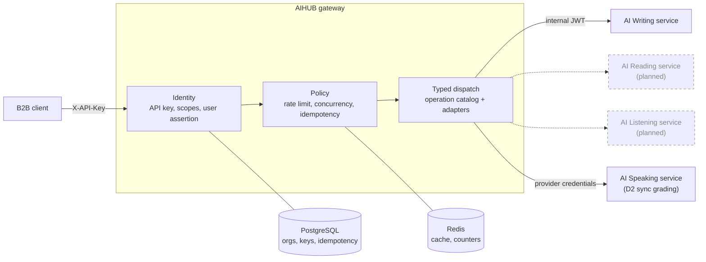

# AIHUB Backend

AIHUB is a B2B multi-tenant AI API Gateway and identity broker. The backend is a single NestJS/Fastify application. The shipped slices are Writing and the synchronous AI Speaking grading proxy; the gateway owns organization identity, scopes, metering, quota, idempotency, and typed dispatch while each AI service owns its business behavior.

## Architecture

AIHUB terminates the public API, authenticates the organization, enforces its
limits, then dispatches one typed operation to a private AI service.
PostgreSQL holds control-plane truth; Redis holds only cache, counters, and
protection state. Writing and the D2 synchronous Speaking proxy are shipped;
the future asynchronous Speaking flow and the other services reuse the same
gateway path when they are implemented.



## Quick start

```text
pnpm install
pnpm dev
```

The bootstrap health route is `GET http://localhost:3000/health`. Writing and
Speaking routes require a real API key when
`AIHUB_ALLOW_UNAUTHENTICATED_DEV` is not enabled. See the [local demo
guide](docs/local-demo.md) for authenticated Writing and multipart Speaking
requests.

For a local authenticated run, copy `.env.example` to `.env`, start
PostgreSQL and Redis, then apply the control-plane migration:

```text
docker compose up -d
pnpm migrate
pnpm cli org:create --name "Acme Edu" --entitlements writing,speaking
pnpm cli key:create --org org_... --name "Local backend" --scopes writing.grade,speaking.grade --envs development
```

Schedule `pnpm cli idempotency:cleanup` from the deployment environment once
per night to remove expired idempotency records. The command reports the
deleted row count and exits non-zero when PostgreSQL is unavailable.

The key command prints the raw API key once. Store it outside the repository
and send it as `X-API-Key`.

For a ready-to-call local demo, use `pnpm demo:bootstrap "Acme Edu"` after
PostgreSQL is running. It creates the demo organization and credentials; use
`pnpm dev:assertion [user_id]` to mint a fresh user assertion.

## Verification

```text
pnpm test
pnpm type-check
pnpm arch-check
pnpm verify
```

`pnpm verify` runs Biome, strict TypeScript, Jest, and the Clean Architecture dependency check.

## Source layout

```text
src/common/       shared errors, request context, and redaction
src/catalog/      typed operation routing metadata
src/contracts/    TypeBox boundary contracts
src/modules/      identity, gateway, Writing, and Speaking application seams
src/downstream/   pure AI-service request/response adapter seams
test/             integration/e2e tests when external boundaries exist
```

Customers integrating against the API should read the [integration guide](docs/integration-guide.md); the endpoint reference is served at `GET /docs`.

AI service teams should use the versioned [AI Speaking provider contract](docs/contracts/ai-services/ai-speaking-grading-v1.md) and [AI Writing provider contract](docs/contracts/ai-services/ai-writing-grading-v1.md) when changing downstream request or response shapes.

Operators should use the [AI Writing canary runbook](docs/operations/canary-ai-writing.md)
and run `pnpm canary:ai-writing` with the documented environment variables.

Read [CONTEXT.md](CONTEXT.md) for the short glossary, then the [spec index](docs/superpowers/specs/2026-09-07-aihub/README.md) before changing behavior. Shared workflow rules live in [AGENTS.md](AGENTS.md); Claude-specific routing lives in [CLAUDE.md](CLAUDE.md) and `.claude/`.

The Writing grading response contract is resolved. The live service was called on 2026-09-07, the captured responses are committed under `test/fixtures/ai-writing/`, and the shared grading parser is implemented against them. The D2 Speaking routes are implemented as synchronous multipart and JSON-by-URL proxies at `POST /v1/ielts/speaking/grading` and `POST /v1/ielts/speaking/grading-json`; both use the approved normalized response boundary and redacted fixture. The future asynchronous `POST /v1/speaking/grade` operation remains a separate roadmap item.

The rule that produced that fixture still stands for every other service: never write a parser from a guess. Capture a real response first, commit it as a fixture, and map from that.
